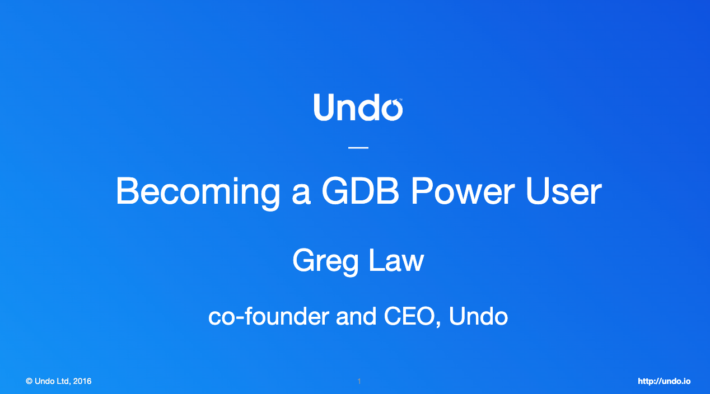

# GDB-Tutorial
A Simple Tutorial of GDB. This tutorial are mainly from CPPCon 2015 and CPPCon 2016.

## CPPCon 2015: Give Me 15 Minutes and I'll Change Your View of GDB

This is a lightning talk about 15 minutes, which gives a simple introduction of how to use GDB in a clever way.

By this video, you will learn how to use GDB as a mordern developer rather than a developer of neanderthalensis. :)

Slides form [CPPCon 2015](https://github.com/CppCon/CppCon2015/blob/master/Lightning%20Talks%20and%20Lunch%20Sessions/Give%20Me%2015%20Minutes%20and%20I'll%20Change%20Your%20View%20of%20GDB/Give%20Me%2015%20Minutes%20and%20I'll%20Change%20Your%20View%20of%20GDB%20-%20Greg%20Law%20-%20CppCon%202015.pdf)

YouTube Video: https://www.youtube.com/watch?v=PorfLSr3DDI

Developer from China: https://www.bilibili.com/video/BV1rN4y1s7LA?vd_source=214871085a518d6559a5be7d13ee2374

## CPPCon2016: GDB - a lot more than you realized

Due to limited time, Greg only gives a 15 minutes lighting presention in CPPCon 2015. So in CPPCon 2016, Greg was invited to give a full CPPCon presentation.

All skills presented in CPPCon 2015 are covered in CPPCon 2016, so I highly recommend you watch 2016's full version.

Slide from [CPPCon 2016](https://github.com/CppCon/CppCon2016/blob/master/Tutorials/GDB%20-%20a%20lot%20more%20than%20you%20realized/GDB%20-%20a%20lot%20more%20than%20you%20realized%20-%20Greg%20Law%20-%20CppCon%202016.pdf)

YouTube Video: https://www.youtube.com/watch?v=-n9Fkq1e6sg

Developer from China: https://www.bilibili.com/video/BV1Zk4y1w7ih?vd_source=214871085a518d6559a5be7d13ee2374

